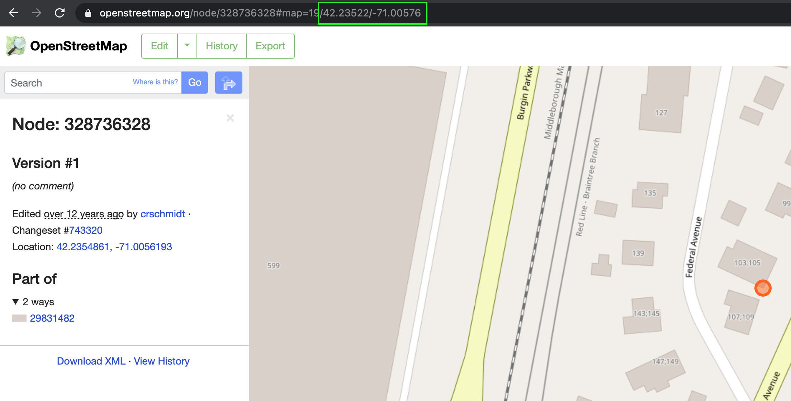
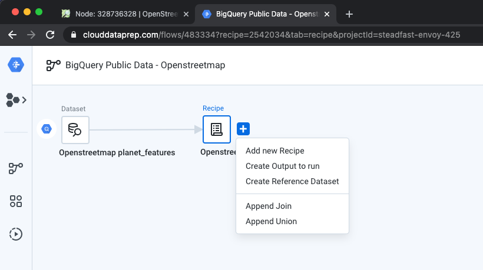
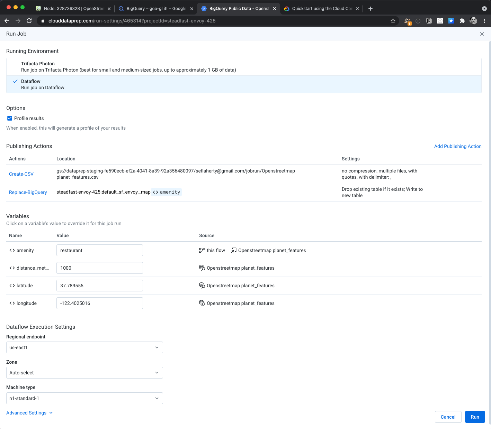
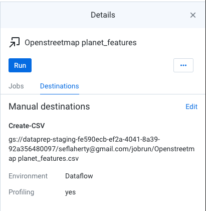
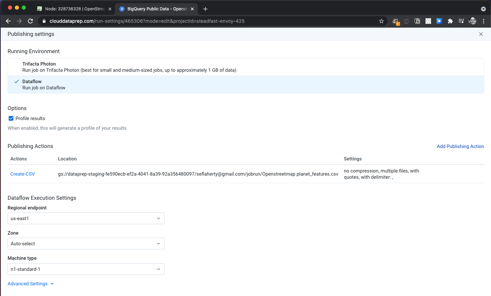

#
Presented by [Vijay Balasubramaniam on LinkedIn](https://www.linkedin.com/posts/vbalasu_openstreetmap-clouddataprep-bigquery-activity-6792506724403286016-DEwU)

## Resources
[GitHub Repo](https://github.com/vbalasu/dataprep-openstreetmap)

## Tasks
1. Go to [OpenStreetMap](https://openstreetmap.org) and enter a location you want to use as the center of the search.
   *  Click the small "i" symbol on the right panel, the browser location bar will reveal the latlong of the location. Copy these values.

2. Open the [Google Sheet](https://docs.google.com/spreadsheets/d/1tioaPCZ4cmLno0jaFRzPwDQIRURu7O52Xvp_EeX_2x4/edit#gid=0) prepared for this exercise and copy to your own Google Drive.
3. Open [Cloud Dataprep](https://clouddataprep.com/). Trust the onboarding process and follow the prompts to set up Trifacta for your project.
4. Download the dataprep flow from the GitHub Repo. In Cloud Dataprep, go to the `Flows` pane (left gutter-panel) and choose `Import Flow`. Choose the zip file you downloaded when prompted.
5. Click the 'Recipe' icon and select 'Create Output to run'.  In the 'Details' panel, select a publishing action, click 'Edit', then 'Add' the publishing action. Select BigQuery as the object for the publishing action. Choose the default schema (_Note, I had to create this_). Click 'Create a new table'. This will be a parameterized table, so click 'Parameterize destination' and enter `map_` into the text box. A pop-up will further this affordance by allowing you to create a variable `< >`. Let the variable Name be 'amenity' and the Default value be 'restaurant'
6. Select the 'Output' icon and push 'Run'. You may customize the parameters for amenity, distance_meters, latitude and longitude. _This is where your latlong values from earlier come into play._
7. Repeat the prior actions for each amenity. Each time, a new table will written for it. _You may run multiple jobs in parallel._ 
8. Return to the Google Drive version of the spreadsheet to view the results
   * For those with Google Workspace Enterprise: choose Data -> Data connectors -> Connect to BigQuery, then choose the tables created in the prior steps. _Delete any existing spreadsheets that begin with `map_` beforehand._
   * For those without access to the BigQuery Data Connector, download the output from Dataprep as a CSV on Cloud Storage and import it into the spreadsheet.

