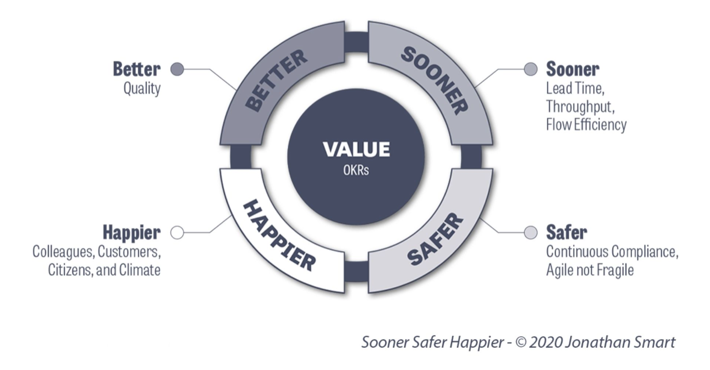

# Blurb/Elevator Pitch TEMPLATE
#### Example provided at 'Nerding Out is Greater Than Networking' by [Martin McGovern on TEAL](https://lu.ma/event/evt-YPwhq1SpQ7h3MQH?pk=g-idZ2pvmddDvtYAH) on Thurs. 2021-05-13 4:00PM EDT

> Merging a background in (previous role) with (current focus) I help companies (get these results).

#### via TEAL Blurb builder

**Short**:
TKTKTK

**Medium**:
TKTKTK

**Long**:
[My name is *$name* and I am very excited to talk with you.] I am interested in being a "go-to" person in connecting data and analytics-ready products to businesses [analytics and functional teams, such as Operations, Product, Sales & Marketing… know your audience and tailor].
My strongest area lies in 20 years Professional Services experience in Business Intelligence.
Things that I was responsible for would include:
1. Needs Assessments -> Understand who is the customer? How and what provides them value?
1. Product Knowledge\Content Assessments -> Understanding what product-based solutions will produce that value.
1. Prepare Backend -> Databases, data-flows, user\group profile, readiness–determine priorities and prerequisites.
1. Artifact Creation -> Reports, visualizations, portals, embeddings (think: twitter cards)

☝️ The last two points are an iterative process and champion practices like [BVSSH](https://soonersaferhappier.com/what-is-bvssh/).

